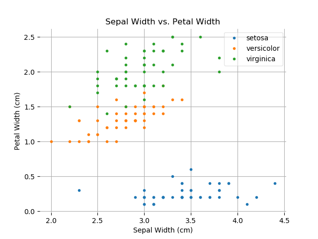
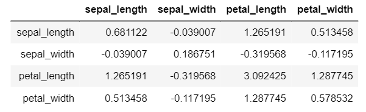
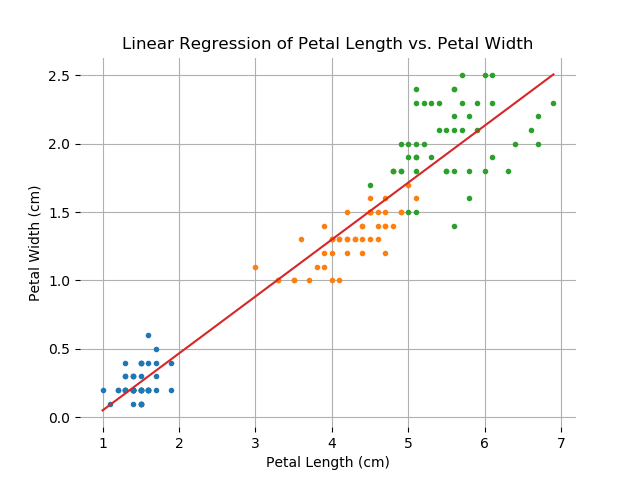
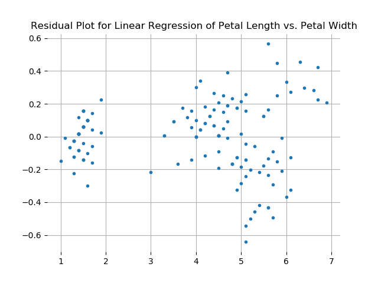
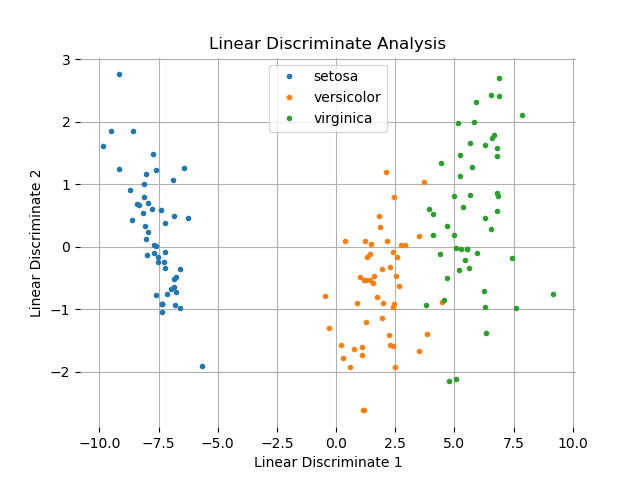
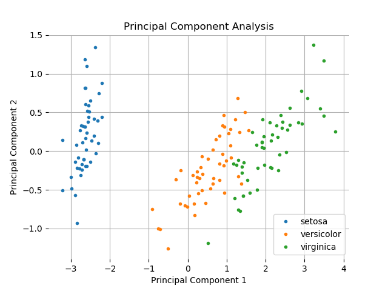

# Programming and Scripting Project
# Analysis of Fisher's Iris Dataset

## Table of Contents
1. [Housekeeping](#housekeeping)
    * [Python Files in this Repository](#files-in-this-repository)
    * [How to Download this Repository](#how-to-download-this-repository)
    * [What is Needed to Run the Python Scripts](#what-is-needed-to-run-the-python-scripts)
    * [How to Run the Python Scripts](#how-to-run-the-python-scripts)
1. [Introduction](#introduction)
    * [What is the Iris Dataset?](#what-is-the-iris-dataset?)
    * [Why is the Iris Dataset Still Relevant?](#why-is-the-iris-dataset-still-relevant?)
1. [Analysis of the Dataset](#analysis-of-the-data-set)
    1. [Conceptualizing the Dataset](#conceptualizing-the-data-set)
    1. [Plotting the Dataset](#plotting-the-dataset)
        * [Histograms](#histograms)
        * [Box Plots](#box-plots)
        * [Scatter Plots](#scatter-plots)
        * [Parallel Coordinates Plots](#parallel-coordinates-plot)
    1. [Finding Correlations Between the Variables](#finding-correlations-between-the-variables)
        *  [Using Linear Regression](#using-linear-regression)
    1. [Statistical Classification of the Data](#statistical-classification-of-the-data)
        *  [Linear Discriminant Analysis of the Dataset](*linear-discriminate-analysis-of-the-dataset)
1. [Appendix](#appendix)
    * [Definitions of Key Terms](#definition-of-key-terms)
1. [References](#references)

# Housekeeping

## Python Files in this Repository
* an 'analysis' file which is the main application script and which imports and runs the functions in the other files
* a 'createBoxplots' file that saves boxplots overlayed with swarm plots to the plots\boxplots folder
* a 'createDataFrame' file that creates a pandas dataframe object based on the irisDataSet file
* a 'createHistograms' file that saves histograms for to the plots\histograms folder
* a 'createParallelCoordinates' file that saves a parallel coordinates plot to the plots\parallelCoordinates folder
* a 'createScatterPlots' file that saves scatter plots to the plots\scatterPlots folder
* a 'createSummaryStatistics' file that saves summary statistics for each species to a csv file in the summaryStatistics folder
* a 'dimensionalityReduction' file that performs various dimensionality reductions and saves the plotted results to files in the plots\dimensionalityReduction folder
* a 'verifyIntegrityOfDataset' file to do just that

## How to Download this Repository
Click on the green 'Clone or download' button near the top right of this page, and then select 'Download ZIP'. You will then need to unzip the downloaded file. You can download 7-zip [here](https://www.7-zip.org/download.html).

## What is Needed to Run the Python Scripts
Python 3.7.4 was used to create the scripts in this repository (download it [here](https://www.python.org/downloads/)). Detailed instructions on how to download and install the latest version of Python are available [here](https://realpython.com/installing-python/). Any version of Python 3 can run the scripts. You can also download Python by downloading the Python distribution, Anaconda. You can download Anaconda [here](https://www.anaconda.com/distribution/), and you will find instructions on how to download and install Anaconda for Windows [here](https://docs.anaconda.com/anaconda/install/windows/).

## How to Run the Python Scripts
See the section 'How to Run Python Scripts Using the Command-Line' [here](https://realpython.com/run-python-scripts/).

# Introduction
This ReadMe's analysis of the Iris Dataset is structured as follows:
* The dataset is described
* The data is conceptualized and questions about the dataset are formulated based on this conceptualization
* The data is plotted, and rudimentary visual analyses of the data are undertaken based on the plots
* The relationships between the variables in the dataset are analysed with <a href="#linear regression">linear regression</a> techniques
* <a href="#Statistical classification">Statistical classification</a> of the data is undertaken using a <a href="#supervised learning">supervised learning</a> technique, (<a href="#linear discriminate analysis">linear discriminate analysis</a>)

## What is the Iris Dataset

From Wikipedia:
> The Iris flower data set or Fisher's Iris data set is a [multivariate](#multivariate) (these blue links will take you to a definition in the appendix section below) data set introduced by the British statistician and biologist Ronald Fisher in his 1936 paper *The use of multiple measurements in taxonomic problems as an example of <a href="#linear discriminate analysis">linear discriminate analysis</a>.
> The data set consists of 50 samples from each of three species of Iris (Iris setosa, Iris virginica and Iris versicolor). Four features were measured from each sample: the length and the width of the sepals and petals, in centimeters. Based on the combination of these four features, Fisher developed a linear discriminant model to distinguish the species from each other. [1]

## Why is the Iris Dataset Still Relevant?
The Iris Dataset remains relevant because:
* Its analysis by Fisher was a foundational moment in the history of data analytics, particularly in relation to the development of <a href="#linear discriminate analysis">linear discriminate analysis</a>.
* It is well suited to being used as an educational tool in data analysis: the sample size is small at 150 flowers; the data is of that of everyday life (a common flower rather than some deep sea flora); the variables are not intimidatingly scientific (e.g. petal length); and the measurements are easily imaginable (a few centimeters).
* It can be used to explain the basic difference between <a href="#supervised learning">supervised learning</a> and <a href="#unsupervised learning">unsupervised learning</a> techniques in machine learning.
* Consisting of three species of the Iris flower, two of which are not immediately distinguishable based on the measurements obtained, the Iris dataset has often been used to test <a href="#statistical classification">statistical classification</a> techniques in machine learning, i.e. how to teach a program to categorize an object based on its attributes.

# **Analysis of the Dataset**

## Conceptualizing the Dataset
While it's all very well to say that the dataset consists of three species of iris flowers and their petal and sepal lengths and widths, it is also important to have an understanding of what the data, for lack of a better word, *means*. This can be achieved by conceptualizing the relationships between the variables in the dataset; and doing this will bring one a good part of the way towards understanding what the dataset can actually be used for.

In a sense we have done a certain amount of conceptualizing already: although the three species of flower are represented as nothing more than variables in the dataset - no different from petal length, for example - we have already been referring to them as something more than *just* a variable, as a *special* kind of variable, as it were.

The differentiation made in Object Oriented Programming between 'Is-a' and 'Has-a' relationships effectively captures the difference between the species variable and the other variables in the dataset: each species *is* an iris flower while each species *has* a sepal width, for example.

    

 

What does this mean then for our analysis of the dataset? Well, we could probably guess that it would be interesting to compare the species against each other, and indeed that this would likely be much more interesting than looking at the dataset as a whole without distinguishing between the species.
Already the 'anchor' question that any analysis of the dataset is likely to confront arises: can the species be distinguished purely based on their respective sepal and petal lengths and widths? And this is exactly where the machine learning analyses of the dataset begin: could a program be taught to determine the species of an iris flower based on its sepal and petal length and width?
But we are jumping the gun here, and while it is important to come into any dataset primed with questions, there is only so far one can get without getting one's hands dirty with the data.
 
 

    Setosa Summary Statistics

 

    

 
 

    Versicolor Summary Statistics

 

    

 

    Virginica Summary Statistics

 
 

    

 

Now wasn't that just supremely uninteresting. I'm afraid these kind of statistics simply don't lend themselves to interesting analysis, although the means and standard deviations are of course important values that will be used in omre deatiled analyses.

## Plotting the Dataset

### Histograms
Ok, so plotting histograms doesn't exactly constitute getting one's hands dirty: histograms are by nature heavily sanitised. They are easy to read, but don't reveal much about anything. And yet histograms remain a nice entry point into any dataset; they give one a rough idea of how the values for each variable are spread out or clumped together.
Because histograms are easy to read, there is more value in including four of them in the one image rather than separately - this way one can at least see how the spread of the variables compare against each other. I have included two groups of histograms here, one with species undistinguished, and one with them distinguished.

In the case of the first group (histograms for each of the variables independent of species), I decided not to vary the bins across the histograms. While this is not ideal in the sense that there will be a lot of "white space" on some of the histograms, I think this is made up for by the ease with which one can compare the histograms, i.e. one does not have to factor in the range of the bins but can compare the variables and species purely by looking at the plots.
Eight is the upper bound (virginica sepal length) and zero is the lower (setosa petal width). While bins of 0.25 width are probably the most visually appealing, the setosa-petal values are clumped together so much that bins with a width of 0.25 really aren"t granular enough. Bins of 0.125 have been used instead.

    

In the case of the second group (histograms for each of the variables where the species are distinguished), because we are concerned here with comparing the species against each other on the same axes, there is less need to have the x-ticks, y-ticks and bins the same across all axes; we are not so much comparing the different plots as the comparing the species within each of the plots. As such we can optimize the scale and ticks for each of the plots, and simply allocate 10 bins for each plot.

    

Clearly, the second group of histograms are much more interesting. The first group only show us that the variables have different ranges of values; but this difference is of course to be expected. The plots in the second group on the other hand can at least show us where there are differences between the species themselves. We can see that the species differ much in their respective petal lengths and widths, whereas there is much overlap in terms of their sepal lengths and widths.
We can also see that the setosas are much more distinguishable than the versicolors and virginicas, which both have overlapping ranges of variable values. Indeed, based on the histogram for petal lengths, we could create a function to determine whether or not an iris flower was a setosa based on its petal length: if its petal length is less than 2.5 cm, then it is a setosa, if greater then it must be either a versicolor or a virginica. But once we have sucked dry that particularly clean division between the species, the histograms stop talking to us. Other plots will have to be probed.

### Box Plots

Box plots are perhaps the natural progression from histograms. Like histograms they show the *spread* of each variables values; unlike histograms, however, they only distinguish between the quartiles. While they thus give us a less granular perspective than histograms, it can often be particularly interesting to see how the ranges of values in each quartile differ. Generally one would expect the ranges of values in the first and fourth quartiles to be greater than those of the second third, as is the case in <a href="#normal distribution">normal distribution</a>.
Box plots can be interesting then if they should that a variable does *not* have a normal distribution. As it turns, the variables *do* have normal distributions, so to make these box plots more bearable, I have superimposed swarm plots onto them, which offer the granularity that box plots lack.

I have chosen to show the box plots for sepal and petal lengths - with the species distinguished - because at least these are somewhat interesting to compare: the ranges of values for sepal length is far greater than for petal length, and the narrow range of values for setosa petal length contrasts with all the other ranges.

    

    

However, these box plots only tells us what the histograms have already told us: that of the four variables in the dataset petal length is likely to be the best <a href="#discriminant">discriminant</a> for the species of an iris flower. As Jay-Z once said: 'on to the next one'.

### Scatter Plots

Finally, we can actually begin to touch the individual data points and get to grips with the grime of the irises. Scatter plots allow us to move on from looking at variables in isolation to looking at the relationships between them. While histograms and box plots can tell us if the species' variables have differing or similar ranges of values, they cannot tell us if there is any relationship between the variables - whether or not, for example, irises with long petals also tend to have wide petals. And with that we have our first scatter plot, and perhaps the most visually appealing plot of the iris dataset:

    

Of course, while such a scatter plot is satisfying to look at, in a certain sense it is not very interesting. Clearly, for all three species, as petal length increases so too does petal width. It is the *clearly* here that makes the plot not all that interesting. Indeed, the species are even clearly distinguished in this plot, with only a small overlap between versicolors with long and wide petals and virginicas with short and thin petals. What is interesting is that even though the histogram for petal lengths already showed us that petal length was able to determine if an iris was a setosa or not, it did not clearly suggest that it could also be used with reasonable accuracy to also determine whether an iris flower is a versicolor or virginica.
This is because in the histogram the data is not represented directly; rather we are seeing the *bins*, and thus there appears to be much more overlap than their actually is.

Exactly because the above plot is so easy to read and provides us with interesting, it is the kind of plot that a data analyst should in many ways dread; it is so easy to  interpret that it does away with the need for the kind of sophisticated analysis that supposedly only data analysts can provide...

We should look at a more ambiguous plot, then - enter sepal width versus petal width (you can hear Jay-Z's encouragemant I hope):

    

Okay, so there are clearly still some trends here. Versicolors' and virginicas' sepal widths visibly tend to increase with their petal widths, but other than that? There doesn't appear to be any relationship between setosa sepal and petal width, and the versicolors and virginicas appear to be indistinguishable in terms of their sepal widths.
But this is just where our first interesting questions appears: will it be at all possible to distinguish the versicolors and the virginicas based on their sepal and petal lengths and widths?

Apart from asking this question and querying the plots with are eyes to hedge an answer, and apart from finding such clean correlations as in the plot of petal length versus petal width, the scatter plots can't reveal much more to us. The next step then would be to look at each of the possible scatter plots and see how distinguishable the species are in them as well as if the variables are correlated with each other. Hence, the we arrive at the infamous pair plot / scatter matrix:

    

Looking at all of the scatter plots in such a matrix makes it very easy to see at a glance the relationships between the species and between the sepal and petal lengths and widths of each of the species. We can see that in many cases there doesn't appear to be a strong correlation between the lengths and widths, while in other cases it appears there are. Likewise we can very clearly see that the setosas seem to live in a world of their own.
What is perhaps most intriguing is how the virginicas almost appear as extensions of the versicolors: in many of the plots their variables appear to correlated in the same way with the only difference being that the virginicas' variables' values are greater - if one didn't know that they were indeed different species, one would be forgiven for assuming that they were in fact the same species, with the virginicas accounting for the third and fourth quartiles of values and the versicolor the first and second.
But again, while this is all very interesting, there is only so much one can do with the plots. In effect even the scatter plots are not that grimy after all; in order to really get into the muck of the dataset one has to engage with the false gods of mathematics.

### Parallel Coordinates

Before taking the dive into the realm of unforgiving functions, there is one last plot that is worth having a look at.

The parallel coordinates plot is hands down, no question, absolutement, god-forgive-you-if-you-doubt-it the most beautiful of plots of the iris data set. I mean just look at it:

    

The parallel coordinates plot is quite simply revelatory. Where all the other plots tease us with tit-bits of truth, this fellow reveals to us the truth himself. And there is a reason for this: the parallel coordinates plot contains every single bit of data in the iris dataset - nothing is left out.

Okay, so enough with the teacherly enthusiasm, but nonetheless, one must admit that at a mere glance at this plot one can see how similar the versicolors and virginicas are to each other, and just how different they are both from the setosas. They both follow a zigzag pattern, with the virginicas' variables having greater values, particularly in the case of the sepal and petal lengths. Contrast this with the poor setosa, that only has a simpering decline to show for itself.

## Finding Correlations Between the Variables

A key component of data analysis is of course the determination of whether or not variables are correlated with each other, and while scatter plots are helpful for visually revealing correlations, in order to quantify correlations one needs to move beyond plots and use math to coerce a value from the data that would somehow represent the extent to which the variables are correlated.
One of the mathematical technique for achieving this coercion is called *regression analysis*, although it might be more helpful to think of it as a *progression* analysis, i.e. how the variable-values progress with each other: if one variable increases/progresses what happens to the other? Could one go so far as to say that one variable is dependent on another variable? This is what regression analysis is meant to achieve: an understanding of just how much an independent variable affects the value of a dependent variable.

### Using Linear Regression

The most common kind of regression analysis is <a href="#linear regression">linear regression</a>, which tries to find a straight line (hence 'linear') that describes the relationship between one dependent variable and one or more explanatory variables, although here we will only perform *single* linear regression, which only uses one explanatory variable. In performing linear regression one will also calculate the variable's <a href="#covariance">covariance</a>, their <a href="#coefficient of correlation">coefficient of correlation</a>, as well as their <a href="#coefficient of determination">coefficient of determination</a>, the latter being the most useful indicator of how closely the variables are related.

It must in a sense remain an open question whether or not in order to perform data analysis to the best of his ability a data analyst needs to understands the mathematical basis of the tools he uses. Programming languages such as Python and R contain packages that allow one to perform complex mathematical manipulations simply by calling ready-made functions. For example, if we want use Python to create a line capable of representing the relationship between two variables, we can simply import the Pandas package and

To better understand what is going on here, I find it helpful to dive into the mathematics. There is a nice, simple explanation of how to create a linear regression plot <a href="https://machinelearningmastery.com/implement-simple-linear-regression-scratch-python/">here</a>. The equation for the regression line is <em>y = b0 + b1 * x</em>, where *b0* is the y-intercept and *b1* is the slope of the line. *b1*, known as the regression coefficient, is defined as the <a href="#covariance">covariance</a> of the two variables divided by the variance of the explanatory/independent variable, i.e. its range. *b0* is defined as the regression coefficient multiplied by the mean of the independt variable, subtracted from the mean of the dependent variable. In order to calculate the covariance I will manually calculate the covariance matrix for all the variables, which has many uses in data analysis beyond linear regression and is thus useful to understand. Once the covariance matrix is calculated, we can also calculating the coefficients of <a href="#coefficient of correlation">correlation</a> and <a href="#coefficient of determination">determination</a>, which also provide insight into how the variables are related.

We will also want to create the residual plot for each attempt at a linear regression plot. If the y variable value can be 'predicted' with the linear regression equation as *b0 + b1 * x*, then the residual value is the difference between the actual y value and the predicted y value, and as such the residual plot consists of the explanatory variable values plotted against the magnitude of how much the actual dependent variables values differ from the predicted values (the 'residual' values). We want to make sure that there are no patterns in the residual plot, i.e. that the residuals are not in any way explained by the independent variables, such that their coefficient of determination is as close to zero as possible.

We will perform single linear regression analysis on petal length and petal width without distinguishing between the species, as from the scatter plots above these appear to be the most closely correlated variables. The first step then is to calculate the variables' covariance, the steps of which are as follows:
 

    

 
The script used to calculate the covariance is as follows
 
 

    

 
One first calcualtes the scatter matrix:
 

    

 
Followed by the covariance matrix:
 

    

 
Which is closely followed by the correlation matrix:
 

    

 
And then finally the 'determination matrix':
 

    

 
Once the covariance matrix is calculated, it is straight forwared to calculate the regression coefficient (b1) and the y-intercept (b0):
 
 

    

 
And finally  the following linear regression plot is achieved:
 

    

 

Along with the following residual plot:
 

    

 

The above residual plot is perhaps the most fascinating of all those so far shown, precisely because of its ambiguity. We would like it to reveal no pattern, and yet for petal lengths of between five and six cm most of the residuals are negative, while for the rest of the petal lengths there appears to be a slight upward trend such that the larger the petal length the greater the residual. This does not mean that petal length and petal length are not correlated, but rather it suggests that there is some other factor that is determining petal width rather than petal length. It is interesting to note that if one looks at the scatter plot for petal length vs petal width, above, the only petal lengths of between five and six cm are virginicas, and the correlation between virginicas' petal lengths and widths appears to be by far the weakest, would lends credit to the idea that the is some other factor that determines an iris flower of 5-6 cm petal length's petal width than its petal length. This in itself shows the usefulness of residual plots.

## Statistical Classification of the Data

As mentioned above, one of the reasons - if not *the* reason - for the Iris dataset's continued popularity as an educational tool, is the fact that it was the dataset that Fisher worked with to develop <a href="#Linear Discriminate Analysis">Linear Discriminate Analysis</a> (LDA), which is a <a href="#statistical classification">statistical classification</a> technique.

### Linear Discriminant Analysis of the Dataset

Linear discriminant analysis (LDA), normal discriminant analysis (NDA), or discriminant function analysis is a  a method used in statistics, pattern recognition, and machine learning to find a linear combination of features that characterizes, i.e. is capable of discriminating between, two or more classes of objects or events [3] (in the case of the Iris dataset we are looking to discriminate between the species).
In mathematics, a linear combination is an expression constructed from a set of terms by multiplying each term by a constant and adding the results (e.g. a linear combination of x and y would be any expression of the form ax + by, where a and b are constants) [4].
However, how exactly linear combinations are come upon by LDA is beyond the scope of this repository, so instead we can simply think of the results of LDA as <a href="#discriminant">discriminants</a>.

It is important to note that while LDA is often refered to as a kinf of dimensionality reduction, it is in reality much more than that. Dimensionality reduction simply consists in taking two or more dimension (i.e. properties of an object that once plotted each become an axis), and reducing them to a lesser amount of dimensions, typically one or two, *while retaining as much of the information contained in the original dimensions as possible*.
The reason for doing this is that multi-dimensional data, for example four-dimensional data as in the case of the Iris dataset, is very different for humans to get their heads around. While a human mind reasonably well trained in pattern-finding can look at a 2D plot and *see* roughly what is going on, anything more than 2D presents a challenge. The solution to this is thus to reduce the three dimensions to two, such that minimal information is lost in this reduction and the human eye can more readily see patterns in the data.

It is also important to note, however, that dimensionality reduction in itself is meaningless. One could easily, for example, take the variables of each flower in the Iris Dataset and sum them together, and one would have thus performed a dimensionality reduction. Of course, a dimension that consists in the sum of the original dimensions is unlikely to be meaningful. The question is thus, in cases can dimensionality reduction be meaningful? There are generally three cases:
1. The first case is not of meaning, but of use. Reducing an object's dimensionality can make render it much less resource-intensive to include in computations. If one has a massive dataset of millions of objects with hundreds of dimensions each, reducing these dimensions would make it much more feasible to perform computations on the data.
1. The second case is more clearly about meaning. As already said above, the human eye cannot grasp multi-dimensional data easily. By reducing the data's dimensionality to a more human-manageable number (generally 2D), there is a much greater change of one being able to see patterns in the data. The challenge here then is reducing the dimensions into a dimension that is still meaningful, and that leads us onto the third case.
1. The third case is generally associated with machine learning, and in many ways it is a subcase of the second case. Essentially we want here to reduce the data to a dimension (or a small number of dimensions) that will make it possible to discriminate between the data or the classes in the dataset based on that (or those) dimensions. This dimension is what I (but not the literature at large) refer to in the case of class-discrimination as the <a href="#discriminant">discriminant</a>. Not that I distinguish here between dimensionality reductions intended to allow discrimination between the data and those intended to allow discrimination between the classes; there are different sets of algorithms for both of these tasks, the simplest being <a href="#Principal Component Analysis">Principal Component Analysis</a> (PCA) and Linear Discriminate Analysis (LDA) respecively.

What you will notice about the three cases is that they extend each other in the order I have presented them, such that the third case is always at the same time an instance of the second and first cases, while the second case is not necessarily also an instance of the third case, and the first cases is not necessarily an instance of the second or third cases, i.e. one can perform a dimensionality reduction for computational-efficiency reasons (case on1) without finding a discriminant (case three), but one cannot find a discriminant without performing a dimensionality reduction that also happens to allow for more efficient computation of the data.

LDA then, is an example of the third case where a discriminant is sought, so by necessity it is also a example of the first case. Note the LDA seeks a *linear* discriminant. The meaning of 'linear' is beyond the scope of this analysis.

It is helpful when trying to understand what exactly LDA achieves to compare the results of LDA (i.e. the linear discriminants) with three other possible discriminants:
1. The variable in the dataset best able to discriminate between the species, which from the plots above would appear to be petal width.
1. A rudimentary 'homemade' attempt at reducing the flower's dimensions by weighting the dimensions in terms of their ability to allow us discriminate between the classes, i.e. petal width having the most weight, then petal length, and then the sepal values:
1. The results of a Principal Component Analysis (PCA) of the dataset. PCA is similar to LDA except that instead of trying to create a dimension that maximizes the distance between the classes, it tries to create a dimension that maximizes the total distance between the data points themselves. Thus one might say that where LDA creates a class-discriminatn, PCA creates a data-discriminant.

    

    

    

    

We can see quite clearly that the first linear discriminant (LD1) is better at distinguishing between the species than both petal width, our homemade attempt, and even PCA.
Interestingly, the PCA appears to offer the worst results, and our homemade attempt doesn't appear to be any better than petal width. In terms of petal width and the actual linear discriminant, both can successfully distinguish between the setosas, but whereas in the case of petal width, there are several versicolor values that are greater than several virginicas, in the case of LD1 the only overlap between the species is one versicolor value that is greater than six virginicas (there is perhaps one other versicolor value that is greater than one other viriginica).

Clearly then, LDA is a good candidate for discriminating between the species, and thus also for teaching a machine how to determine what species an iris flower is based on its petal and sepal length and width. The better performance of LDA here in comparison to PCA also demonstrates the difference between supervised and unsupervised learning techniques. In a dataset such as this where the classes are already known, LDA, a supervised learning technique, generally outperforms unsupervised techniques such as PCA.

# Appendix

## Definition of Key Terms

<dl>
    <dt><a id="Coefficient of determination">Coefficient of determination</dt>
    <dd>To understand the reason for the existence of the coefficient of determination () and how it is calculated it is best to first understand <a href="#covariance">covariance</a> and <a href="#correlation">correlation</a>. The coefficient of determination is calculated as the result of squaring the coefficient of correlation, *r*, and as such is is known as <em>R2</em> (the difference between *r* and *R* is another matter). It has a value between zero and one, and that value multiplied by one hundred represents the percentage of the dependent variable's value that is determined by the explanatory variable. The coefficient of determination is particularly useful when performing multiple linear regression analysis, where the coefficient of correlation loses much of its intuitive meaning. For example, when trying to understand how height affects weight the correlation coefficient does quite well. However, if we want to understand how both height and age taken together affect weight, we are really finding out how a <a href="#linear combination">linear combination</a> of height and age affects weight, and it wouldn't make much intuitive sense to find the correlation coefficient in order to be able to say that as the linear combination increases so too does weight; it would make much more sense to find the coefficient of determination in order to be able to say that the linear combination oof height and age is capable of explaining whatever percentage of weight.</dd>
    <dt>Correlation</dt>
    <dd>Correlation is best understood as the result of a mathematical operation applied to a variable's <a href="#covariance">covariance</a>, namely dividing the covariance by the product of each of the variables' standard deviation. The result is called the correlation coefficient, *r*, which will always have a value of between negative and positive one, with zero meaning no correlation, one meaning perfect positive correlation, and negative one meaning perfect negative correlation. Importantly, if we square the correlation coefficient we get <a href="#coefficient of determination">the coefficient of determination</a></dd>
    <dt>Covariance</dt>
    <dd>Covariance describes how two variables change with each other, more particulalry how a change in one variable (the independent variable) affects the other variable (the dependent variable). Note, however, that the magnitude of the covariance does not really mean anything, it is only the sign that matters. *cov(x, y) = 2* does not at all mean that if x increases by one y should increase by two, it only means that as x increase y should also increase. A negative covariance means that as x increases y increases. In order to understand how tightly variables are related to each other one must calculate their <a href="#correlation"></dd>, whose magnitude, unlike that of covariance, *does* have significance.
    <dt>Dimensionality Reduction</dt>
    <dd>Dimensionality reduction simply consists in taking two or more dimension (i.e. properties of an object that once plotted each become an axis), and reducing them to a lesser amount of dimensions, typically one or two, <em>while retaining as much of the information contained in the original dimensions as possible</em>.</dd>
    <dt>Discriminant</dt>
    <dd>Discriminant is not a standard term in data analysis, probably because it is a standard term in mathematics and thus there would be room for confusion. But it is useful to understand the 'discriminate' part of <a href="#linear discriminate analysis">linear discriminate analysis</a>. Basically, a discriminant can be thought of as a property (variable) of an object that allows us to determine what class that object belongs to, i.e. we can discriminate between classes based solely on the discriminatn variable (in the case of the Iris Dataset, the three species are the classes). A perfect discriminant would be such that by looking at the value of the discriminant for each object in a dataset we would be able to separate the objects accurately into their different classes. Of course, the 'ready-made' variables of data-sets (such as the iris dataset's petal lengths) are rarely reliable discriminants. In practice, variables have to be <em>combined</em> to produce an accurate discriminant. For more on how this is achieved, please see <a href="#linear combination">linear combination</a>, and for additional context, <a href="#linear discriminate analysis">linear discriminate analysis.</a> </dd>
    <dt>Linear Combination</dt>
    <dd>(Please first read the definition of <a href="#discriminant">discriminant</a>.) In mathematics, a linear combination is an expression constructed from a set of terms by multiplying each term by a constant and adding the results (e.g. a linear combination of x and y would be any expression of the form ax + by, where a and b are constants) [4].</dd>
    <dt>Linear Discriminate Analysis</dt>
    <dd>(Please first read the definitions of <a href="#discriminant">discriminant</a> and <a href="#linear combination">linear combination</a>.) Linear discriminant analysis (LDA), normal discriminant analysis (NDA), or discriminant function analysis is a method used in statistics, pattern recognition, and machine learning to find a linear combination of features that characterizes, i.e. is capable of discriminating between, two or more classes of objects or events [3].</dd>
    <dt>Linear Regression</dt>
    <dd>In statistics, linear regression is a linear approach to modeling the relationship between a scalar response (or dependent variable) and one or more explanatory variables (or independent variables). The case of one explanatory variable is called simple linear regression. For more than one explanatory variable, the process is called multiple linear regression. [9]</dd>
    <dt><a id='Multivariate'>Multivariate</a></dt>
    <dd>Multivariant refers to the property of having multiple variables. Hence a <em>multivariate dataset</em> is a dataset with multiple variables, and <em>multivariate statistics</em> is the statistics of multivariate datasets.</dd>
    <dt>Normal Distribution</dt>
    <dd>A normal distribution is an arrangement of a data set in which most values cluster in the middle of the range and the rest taper off symmetrically toward either extreme [8]. Note, however, that while all normal distributions are bell curves, not all bell curves are normal distributions. Normal distributions are "normal" because according to the central limit theorem, under some conditions the average of many samples (observations) of a random variable with finite mean and variance is itself a random variable whose distribution converges to a normal distribution as the number of samples increases.</dd>
    <dt>Principal Component Analysis</dt>
    <dd>Principal Component Analysis (PCA) is defined as an orthogonal linear transformation that transforms the data to a new coordinate system such that the greatest variance by some scalar projection of the data comes to lie on the first coordinate (called the first principal component), the second greatest variance on the second coordinate, and so on [10]. PCA performs a <a href="#dimensionality reduction">dimensionality reduction</a> such that each new dimensions is the next best possible basis upon which the datapoints can be separated.</dd>
    <dt>Statistical Classification</dt>
    <dd>In machine learning and statistics, classification is the problem of identifying to which of a set of categories (sub-populations) a new observation belongs, on the basis of a training set of data containing observations (or instances) whose category membership is known [7].</dd>
    <dt><a id="Supervised learning">Supervised learning</a></dt>
    <dd>Supervised learning is the machine learning task of learning a function that maps an input to an output based on example input-output pairs. It infers a function from labeled training data. This in contrast to <a href="#unsupervised learning">unsupervised learning</a> that does not have the luxury of data that is labelled [5].</dd>
    <dt><a id="Unsupervised learning">Unsupervised learning</a></dt>
    <dd>Unsupervised learning is a type of machine learning that looks for previously undetected patterns in a data set with no pre-existing labels and with a minimum of human supervision. This in contrast to <a href="#supervised learning">supervised learning</a> that usually makes use of human-labeled data [6].</dd>
</dl>

# References
    1 https://en.wikipedia.org/wiki/Iris_flower_data_set
    2 https://github.com/adam-p/markdown-here/wiki/Markdown-Cheatsheet
    3 https://en.wikipedia.org/wiki/Linear_discriminant_analysis
    4 https://en.wikipedia.org/wiki/Linear_combination
    5 https://en.wikipedia.org/wiki/Supervised_learning
    6 https://en.wikipedia.org/wiki/Unsupervised_learning
    7 https://en.wikipedia.org/wiki/Statistical_classification
    8 https://www.tutorialspoint.com/statistics/normal_distribution.htm
    9 https://en.wikipedia.org/wiki/Linear_regression
    10 https://en.wikipedia.org/wiki/Principal_component_analysis
    11 https://machinelearningmastery.com/implement-simple-linear-regression-scratch-python/
    12 Machine Learning, The Art and Science of Algorithms that Make Sense of Data by Peter Flach

Websites referenced in the python files:

    https://sebastianraschka.com/Articles/2014_python_lda.html
    https://medium.com/codebagng/basic-analysis-of-the-iris-data-set-using-python-2995618a6342
    https://machinelearningmastery.com/k-fold-cross-validation/
    https://riptutorial.com/scikit-learn/example/17296/cross-validation
    https://scikit-learn.org/stable/modules/generated/sklearn.model_selection.cross_val_score.html
    https://medium.com/fintechexplained/what-are-eigenvalues-and-eigenvectors-a-must-know-concept-for-machine-learning-80d0fd330e47
    https://scikit-learn.org/stable/auto_examples/decomposition/plot_pca_vs_lda.html
    https://benalexkeen.com/feature-scaling-with-scikit-learn/
    https://chrisalbon.com/machine_learning/feature_engineering/select_best_number_of_components_in_lda/
    https://pythonmatplotlibtips.blogspot.com/2018/01/compare-pltplot-and-pltscatter-in-speed-python-matplotlib.html
    https://pandas.pydata.org/pandas-docs/stable/reference/api/pandas.DataFrame.groupby.html
    https://realpython.com/pandas-groupby/
    https://www.tutorialspoint.com/python_pandas/python_pandas_groupby.html
    https://matplotlib.org/examples/ticks_and_spines/spines_demo.html
    https://seaborn.pydata.org/generated/seaborn.pairplot.html
    https://towardsdatascience.com/visualizing-data-with-pair-plots-in-python-f228cf529166
    https://stackoverflow.com/questions/4415259/convert-regular-python-string-to-raw-string
    https://stackoverflow.com/questions/11373610/save-matplotlib-file-to-a-directory
    https://matplotlib.org/3.2.1/api/_as_gen/matplotlib.pyplot.subplot.html
    https://matplotlib.org/3.1.3/tutorials/intermediate/tight_layout_guide.html
    http://www.learningaboutelectronics.com/Articles/How-to-change-the-transparency-of-a-graph-plot-in-matplotlib-with-Python.php
    https://www.tutorialspoint.com/python_pandas/python_pandas_groupby.htm
    https://docs.scipy.org/doc/numpy/reference/generated/numpy.unique.html
    https://stackoverflow.com/questions/4415259/convert-regular-python-string-to-raw-string
    https://stackoverflow.com/questions/11373610/save-matplotlib-file-to-a-directory
    https://stackoverflow.com/questions/57533954/how-to-close-seaborn-plots
    https://pandas.pydata.org/pandas-docs/stable/reference/api/pandas.plotting.parallel_coordinates.html
    https://pandas.pydata.org/pandas-docs/stable/user_guide/indexing.html
    https://towardsdatascience.com/how-to-use-residual-plots-for-regression-model-validation-c3c70e8ab378
    https://www.surveygizmo.com/resources/blog/variance-covariance-correlation/
    https://365datascience.com/covariance-linear-correlation-coefficient/
