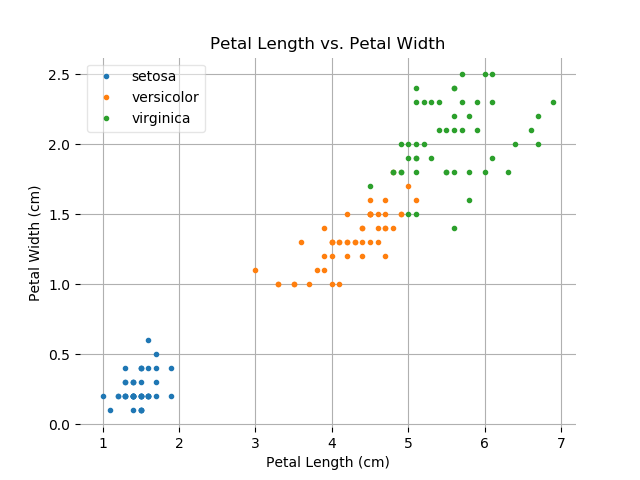

# Programming and Scripting Project
# Analysis of Fisher's Iris Dataset

## Table of Contents
1. [Housekeeping](#housekeeping)
    * [Python Files in this Repository](#files-in-this-repository)
    * [How to Download this Repository](#how-to-download-this-repository)
    * [What is Needed to Run the Python Scripts](#what-is-needed-to-run-the-python-scripts)
    * [How to Run the Python Scripts](#how-to-run-the-python-scripts)
1. [Introduction to the Dataset](#introduction-to-the-dataset)
    * [What is the Iris Dataset?](#what-is-the-iris-dataset?)
    * [Why is the Iris Dataset Still Relevant?](#why-is-the-iris-dataset-still-relevant?)
1. [Analysis of the Dataset](#analysis-of-the-data-set)
    1. [Conceptualizing the Dataset](#conceptualizing-the-data-set)
    1. [Plotting the Dataset](#plotting-the-dataset)
        * [Histograms](#histograms)
        * [Box Plots](#box-plots)
        * [Scatter Plots](#scatter-plots)
        * [Parallel Coordinates Plots](#parallel-coordinates-plot)
    1. [Searching for Correlations](#searching-for-correlations)
    * [Linear Regression](#linear-regression)
    1. [Basic Statistical Classification](#basic-statistical-classification)
    * [Linear Discriminant Analysis](*linear-discriminate-analysis)
    * [Finding the Best Classification Algorithm](#finding-the-best-classification-algorithm)
1. [Appendix](#appendix)
    * [Definitions of Key Terms](#definition-of-key-terms)
1. [References](#references)

# Housekeeping

## Python Files in this Repository
* an 'analysis' file which is the main application script and which imports and runs the functions in the other files
* a 'createBoxplots' file that saves boxplots overlayed with swarm plots to the plots\boxplots folder
* a 'createDataFrame' file that creates a pandas dataframe object based on the irisDataSet file
* a 'createHistograms' file that saves histograms for to the plots\histograms folder
* a 'createParallelCoordinates' file that saves a parallel coordinates plot to the plots\parallelCoordinates folder
* a 'createScatterPlots' file that saves scatter plots to the plots\scatterPlots folder
* a 'createSummaryStatistics' file that saves summary statistics for each species to a csv file in the summaryStatistics folder
* a 'verifyIntegrityOfDataset' file to do just that

## How to Download this Repository
Click on the green 'Clone or download' button near the top right of this page, and then select 'Download ZIP'. You will then need to unzip the downloaded file. You can download 7-zip [here](https://www.7-zip.org/download.html).

## What is Needed to Run the Python Scripts
Python 3.7.4 was used to create the scripts in this repository (download it [here](https://www.python.org/downloads/)). Detailed instructions on how to download and install the latest version of Python are available [here](https://realpython.com/installing-python/). Any version of Python 3 can run the scripts. You can also download Python by downloading the Python distribution, Anaconda. You can download Anaconda [here](https://www.anaconda.com/distribution/), and you will find instructions on how to download and install Anaconda for Windows [here](https://docs.anaconda.com/anaconda/install/windows/).

## How to Run the Python Scripts
See the section 'How to Run Python Scripts Using the Command-Line' [here](https://realpython.com/run-python-scripts/).

# Introduction to the Dataset

## What is the Iris Dataset

From Wikipedia:
> The Iris flower data set or Fisher's Iris data set is a [multivariate](#multivariate) (these blue links will take you to a definition in the appendix section below) data set introduced by the British statistician and biologist Ronald Fisher in his 1936 paper *The use of multiple measurements in taxonomic problems as an example of [linear discriminant analysis](#linear-indiscriminate-analysis)*.
> The data set consists of 50 samples from each of three species of Iris (Iris setosa, Iris virginica and Iris versicolor). Four features were measured from each sample: the length and the width of the sepals and petals, in centimeters. Based on the combination of these four features, Fisher developed a linear discriminant model to distinguish the species from each other. [1]

## Why is the Iris Dataset Still Relevant?
The Iris Dataset remains relevant because:
* Its analysis by Fisher was a foundational moment in the history of data analytics, particularly in relation to the development of [linear discriminant analysis](#linear-indiscriminate-analysis).
* It is well suited to being used as an educational tool in data analysis: the sample size is small at 150 flowers; the data is of that of everyday life (a common flower rather than some deep sea flora); the variables are not intimidatingly scientific (e.g. petal length); and the measurements are easily imaginable (a few centimeters).
* It can be used to explain the difference between [supervised](#supervised-learning) and [unsupervised learning](#unsupervised-learning) techniques in machine learning. This will be expanded on [below](#metro-map-of-the-dataset).
* Consisting of three species of the Iris flower, two of which are not immediately distinguishable based on the measurements obtained, the Iris dataset has often been used to test [statistical classification](#statistical-classification) techniques in machine learning, i.e. how to teach a program to categorize an object based on its attributes.

# **Analysis of the Dataset**

## Conceptualizing the Dataset
While it's all very well to say that the dataset consists of three species of iris flowers and their petal and sepal lengths and widths, it is also important to have an understanding of what the data, for lack of a better word, *means*. This can be achieved by conceptualizing the relationships between the variables in the dataset; and doing this will bring one a good part of the way towards understanding what the dataset can actually be used for.

In a sense we have done a certain amount of conceptualizing already: although the three species of flower are represented as nothing more than variables in the dataset - no different from petal length, for example - we have already been referring to them as something more than *just* a variable, as a *special* kind of variable, as it were.

The differentiation made in Object Oriented Programming between 'Is-a' and 'Has-a' relationships effectively captures the difference between the species variable and the other variables in the dataset: each species *is* an iris flower while each species *has* a sepal width, for example.

    

 

What does this mean then for our analysis of the dataset? Well, we could probably guess that it would be interesting to compare the species against each other, and indeed that this would likely be much more interesting than looking at the dataset as a whole without distinguishing between the species.
Already the 'anchor' question that any analysis of the dataset is likely to confront arises: can the species be distinguished purely based on their respective sepal and petal lengths and widths? And this is exactly where the machine learning analyses of the dataset begin: could a program be taught to determine the species of an iris flower based on its sepal and petal length and width?
But we are jumping the gun here, and while it is important to come into any dataset primed with questions, there is only so far one can get without getting one's hands dirty with the data.

## Histograms
Ok, so plotting histograms doesn't exactly constitute getting one's hands dirty: histograms are by nature heavily sanitised. They are easy to read, but don't reveal much about anything. And yet histograms remain a nice entry point into any dataset; they give one a rough idea of how the values for each variable are spread out or clumped together.
Because histograms are easy to read, there is more value in including four of them in the one image rather than separately - this way one can at least see how the spread of the variables compare against each other. I have included two groups of histograms here, one with species undistinguished, and one with them distinguished.

In the case of the first group (histograms for each of the variables independent of species), I decided not to vary the bins across the histograms. While this is not ideal in the sense that there will be a lot of "white space" on some of the histograms, I think this is made up for by the ease with which one can compare the histograms, i.e. one does not have to factor in the range of the bins but can compare the variables and species purely by looking at the plots.
Eight is the upper bound (virginica sepal length) and zero is the lower (setosa petal width). While bins of 0.25 width are probably the most visually appealing, the setosa-petal values are clumped together so much that bins with a width of 0.25 really aren"t granular enough. Bins of 0.125 have been used instead.

    

In the case of the second group (histograms for each of the variables where the species are distinguished), because we are concerned here with comparing the species against each other on the same axes, there is less need to have the x-ticks, y-ticks and bins the same across all axes; we are not so much comparing the different plots as the comparing the species within each of the plots. As such we can optimize the scale and ticks for each of the plots, and simply allocate 10 bins for each plot.

    

Clearly, the second group of histograms are much more interesting. The first group only show us that the variables have different ranges of values; but this difference is of course to be expected. The plots in the second group on the other hand can at least show us where there are differences between the species themselves. We can see that the species differ much in their respective petal lengths and widths, whereas there is much overlap in terms of their sepal lengths and widths.
We can also see that the setosas are much more distinguishable than the versicolors and virginicas, which both have overlapping ranges of variable values. Indeed, based on the histogram for petal lengths, we could create a function to determine whether or not an iris flower was a setosa based on its petal length: if its petal length is less than 2.5 cm, then it is a setosa, if greater then it must be either a versicolor or a virginica. But once we have sucked dry that particularly clean division between the species, the histograms stop talking to us. Other plots will have to be probed.

## Box Plots

Box plots are perhaps the natural progression from histograms. Like histograms they show the *spread* of each variables values; unlike histograms, however, they only distinguish between the quartiles. While they thus give us a less granular perspective than histograms, it can often be particularly interesting to see how the ranges of values in each quartile differ. Generally one would expect the ranges of values in the first and fourth quartiles to be greater than those of the second third, as is the case in [normal distributions](#normal-distribution).
Box plots can be interesting then if they should that a variable does *not* have a normal distribution. As it turns, the variables *do* have normal distributions, so to make these box plots more bearable, I have superimposed swarm plots onto them, which offer the granularity that box plots lack.

I have chosen to show the box plots for sepal and petal lengths - with the species distinguished - because at least these are somewhat interesting to compare: the ranges of values for sepal length is far greater than for petal length, and the narrow range of values for setosa petal length contrasts with all the other ranges.

    

    

However, these box plots only tells us what the histograms have already told us: that of the four variables in the dataset petal length is likely to be the best [discriminant](#discriminat) for the species of an iris flower. As Jay-Z once said: 'on to the next one'.

## Scatter Plots

Finally, we can actually begin to touch the individual data points and get to grips with the grime of the irises. Scatter plots allow us to move on from looking at variables in isolation to looking at the relationships between them. While histograms and box plots can tell us if the species' variables have differing or similar ranges of values, they cannot tell us if there is any relationship between the variables - whether or not, for example, irises with long petals also tend to have wide petals. And with that we have our first scatter plot, and perhaps the most visually appealing plot of the iris dataset:

    

Of course, while such a scatter plot is satisfying to look at, in a certain sense it is not very interesting. Clearly, for all three species, as petal length increases so too does petal width. It is the *clearly* here that makes the plot not all that interesting. Indeed, the species are even clearly distinguished in this plot, with only a small overlap between versicolors with long and wide petals and virginicas with short and thin petals. What is interesting is that even though the histogram for petal lengths already showed us that petal length was able to determine if an iris was a setosa or not, it did not clearly suggest that it could also be used with reasonable accuracy to also determine whether an iris flower is a versicolor or virginica.
This is because in the histogram the data is not represented directly; rather we are seeing the *bins*, and thus there appears to be much more overlap than their actually is.

Exactly because the above plot is so easy to read and provides us with interesting, it is the kind of plot that a data analyst should in many ways dread; it is so easy to  interpret that it does away with the need for the kind of sophisticated analysis that supposedly only data analysts can provide...

We should look at a more ambiguous plot, then - enter sepal width versus petal width (you can hear Jay-Z's encouragemant I hope):

    

Okay, so there are clearly still some trends here. Versicolors' and virginicas' sepal widths visibly tend to increase with their petal widths, but other than that? There doesn't appear to be any relationship between setosa sepal and petal width, and the versicolors and virginicas appear to be indistinguishable in terms of their sepal widths.
But this is just where our first interesting questions appears: will it be at all possible to distinguish the versicolors and the virginicas based on their sepal and petal lengths and widths?

Apart from asking this question and querying the plots with are eyes to hedge an answer, and apart from finding such clean correlations as in the plot of petal length versus petal width, the scatter plots can't reveal much more to us. The next step then would be to look at each of the possible scatter plots and see how distinguishable the species are in them as well as if the variables are correlated with each other. Hence, the we arrive at the infamous pair plot / scatter matrix:

    

Looking at all of the scatter plots in such a matrix makes it very easy to see at a glance the relationships between the species and between the sepal and petal lengths and widths of each of the species. We can see that in many cases there doesn't appear to be a strong correlation between the lengths and widths, while in other cases it appears there are. Likewise we can very clearly see that the setosas seem to live in a world of their own.
What is perhaps most intriguing is how the virginicas almost appear as extensions of the versicolors: in many of the plots their variables appear to correlated in the same way with the only difference being that the virginicas' variables' values are greater - if one didn't know that they were indeed different species, one would be forgiven for assuming that they were in fact the same species, with the virginicas accounting for the third and fourth quartiles of values and the versicolor the first and second.
But again, while this is all very interesting, there is only so much one can do with the plots. In effect even the scatter plots are not that grimy after all; in order to really get into the muck of the dataset one has to engage with the false gods of mathematics.

## Parallel Coordinates

Before taking the diving into the realm of unforgiving functions, there is one last plot that is worth having a look at.

The parallel coordinates plot is hands down, no question, absolutement, god-forgive-you-if-you-doubt-it the most beautiful of plots of the iris data set. I mean just look at it:

    

The parallel coordinates plot is quite simply revelatory. Where all the other plots tease us with tit-bits of truth, this fellow reveals to us the truth himself. And there is a reason for this: the parallel coordinates plot contains every single bit of data in the iris dataset - nothing is left out.

Okay, so the enthusiasm must be a little overbearing, but nonetheless, at a mere glance at this plot one can see how similar the versicolors and virginicas are to each other, and just how different they are both from the setosas. They both follow a zigzag pattern, with the virginicas' variables have higher values, particularly in the case of the sepal and petal lengths. Contrast this with the poor setosa, that only has a simpering decline to show for itself.

## Linear Regression

# Appendix

## Definition of Key Terms

<dl>
    <dt>Discriminant</dt>
    <dd>Discriminant is not a standard term in data analysis, probably because it is a standard term in mathematics and thus there would be room for confusion. But it is useful to understand the 'discriminate' part of <a href="#linear discriminant analysis">linear discriminate analysis</a>. Basically, a discriminant can be thought of as a property (variable) of an object that allows us to determine what class that object belongs to, i.e. we can discriminate between classes based solely on the discriminatn variable (in the case of the Iris Dataset, the three species are the classes). A perfect discriminant would be such that by looking at the value of the discriminat for each object in a dataset we would be able to separate the objects accurately into their different classes. Of course, the 'ready-made' variables of data-sets (such as the iris dataset's petal lengths) are rarely reliable discriminants. In practice, variables have to be <em>combined</em> to produce an accurate discriminant. For more on how this is achieved, please see <a href="#linear combination">linear combination</a>, and for additional context, <a href="#linear discriminant analysis">linear discriminant analysis.</a> </dd>
    <dt>Linear Combination</dt>
    <dd>(Please first read the definition of <a href="#discriminant">discriminant</a>.) In mathematics, a linear combination is an expression constructed from a set of terms by multiplying each term by a constant and adding the results (e.g. a linear combination of x and y would be any expression of the form ax + by, where a and b are constants) [4].</dd>
    <dt>Linear Discriminate Analysis</dt>
    <dd>(Please first read the definitions of <a href="#discriminant">discriminant</a> and <a href="#linear combination">linear combination</a>.) Linear discriminant analysis (LDA), normal discriminant analysis (NDA), or discriminant function analysis is a generalization of Fisher's linear discriminant, a method used in statistics, pattern recognition, and machine learning to find a <a href="#linear combination">linear combination</a> of features that characterizes or separates two or more classes of objects or events [3].</dd>
    <dt><a id='Multivariate'>Multivariate</a></dt>
    <dd>Multivariant refers to the property of having multiple variables. Hence a <em>multivariate dataset</em> is a dataset with multiple variables, and <em>multivariate statistics</em> is the statistics of multivariate datasets.</dd>
    <dt>Normal Distribution</dt>
    <dd>A normal distribution is an arrangement of a data set in which most values cluster in the middle of the range and the rest taper off symmetrically toward either extreme [8]. Note, however, that while all normal distributions are bell curves, not all bell curves are normal distributions. Normal distributions are "normal" because according to the central limit theorem, under some conditions the average of many samples (observations) of a random variable with finite mean and variance is itself a random variable whose distribution converges to a normal distribution as the number of samples increases.</dd>
    <dt>Statistical Classification</dt>
    <dd>In machine learning and statistics, classification is the problem of identifying to which of a set of categories (sub-populations) a new observation belongs, on the basis of a training set of data containing observations (or instances) whose category membership is known [7].</dd>
    <dt><a id="Supervised learning">Supervised learning</a></dt>
    <dd>Supervised learning is the machine learning task of learning a function that maps an input to an output based on example input-output pairs. It infers a function from labeled training data. This in contrast to <a href="#unsupervised learning">unsupervised learning</a> that does not have the luxury of data that is labelled [5].</dd>
    <dt><a id="Unsupervised learning">Unsupervised learning</a></dt>
    <dd>Unsupervised learning is a type of machine learning that looks for previously undetected patterns in a data set with no pre-existing labels and with a minimum of human supervision. This in contrast to <a href="#supervised learning">supervised learning</a> that usually makes use of human-labeled data [6].</dd>
    <dt></dt>
    <dd></dd>
    <dt></dt>
    <dd></dd>
</dl>

# References
1 https://en.wikipedia.org/wiki/Iris_flower_data_set

2 https://github.com/adam-p/markdown-here/wiki/Markdown-Cheatsheet

3 https://en.wikipedia.org/wiki/Linear_discriminant_analysis

4 https://en.wikipedia.org/wiki/Linear_combination

5 https://en.wikipedia.org/wiki/Supervised_learning

6 https://en.wikipedia.org/wiki/Unsupervised_learning

7 https://en.wikipedia.org/wiki/Statistical_classification

8 https://www.tutorialspoint.com/statistics/normal_distribution.htm

https://sebastianraschka.com/Articles/2014_python_lda.html
